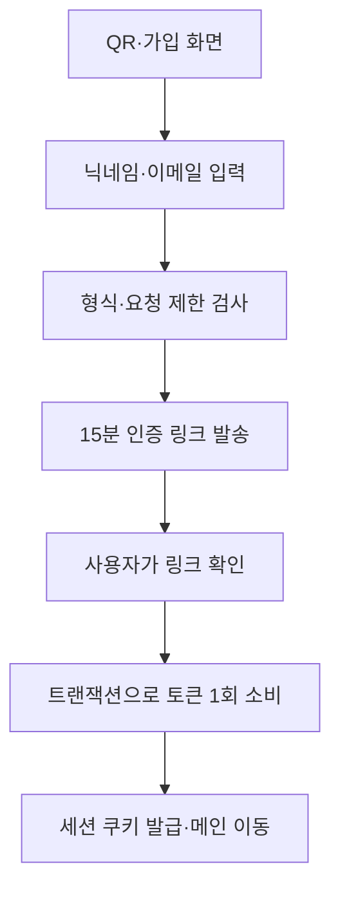
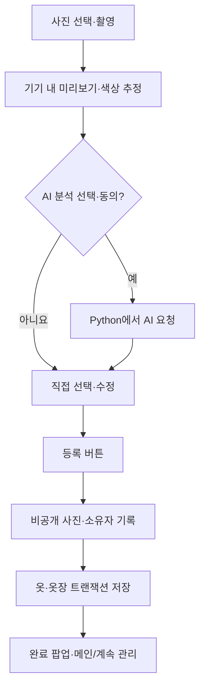
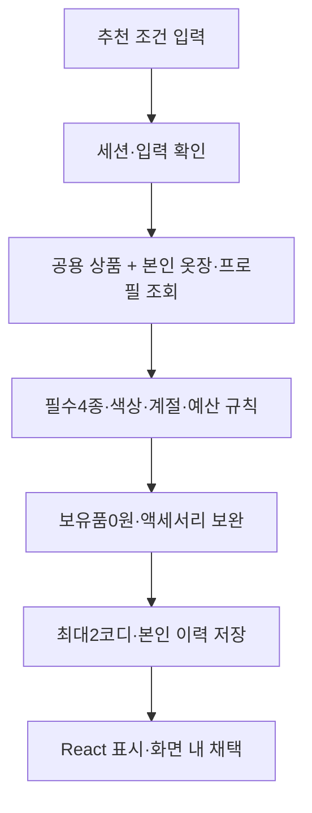

# 주요 처리 흐름

```mermaid
flowchart TD
 A["QR·가입 화면"] --> B["닉네임·이메일 입력"]
 B --> C["형식·요청 제한 검사"]
 C --> D["15분 인증 링크 발송"]
 D --> E["사용자가 링크 확인"]
 E --> F["트랜잭션으로 토큰 1회 소비"]
 F --> G["세션 쿠키 발급·메인 이동"]
```

```mermaid
flowchart TD
 A["사진 선택·촬영"] --> B["기기 내 미리보기·색상 추정"]
 B --> C{"AI 분석 선택·동의?"}
 C -->|예| D["Python에서 AI 요청"]
 C -->|아니요| E["직접 선택·수정"]
 D --> E
 E --> F["등록 버튼"]
 F --> G["비공개 사진·소유자 기록"]
 G --> H["옷·옷장 트랜잭션 저장"]
 H --> I["완료 팝업·메인/계속 관리"]
```

```mermaid
flowchart TD
 A["추천 조건 입력"] --> B["세션·입력 확인"]
 B --> C["공용 상품 + 본인 옷장·프로필 조회"]
 C --> D["필수4종·색상·계절·예산 규칙"]
 D --> E["보유품0원·액세서리 보완"]
 E --> F["최대2코디·본인 이력 저장"]
 F --> G["React 표시·화면 내 채택"]
```

사진 업로드와 의류 저장은 두 HTTP 요청입니다. 의류 저장이 실패하면 업로드만 남을 수 있으므로 운영 점검에서 미참조 파일을 확인합니다. 자동 삭제는 구현하지 않았습니다. 개인 API·사진은 서비스워커 캐시 대상에서 제외합니다. 전체 오프라인 자료 편집 기능은 없습니다.
